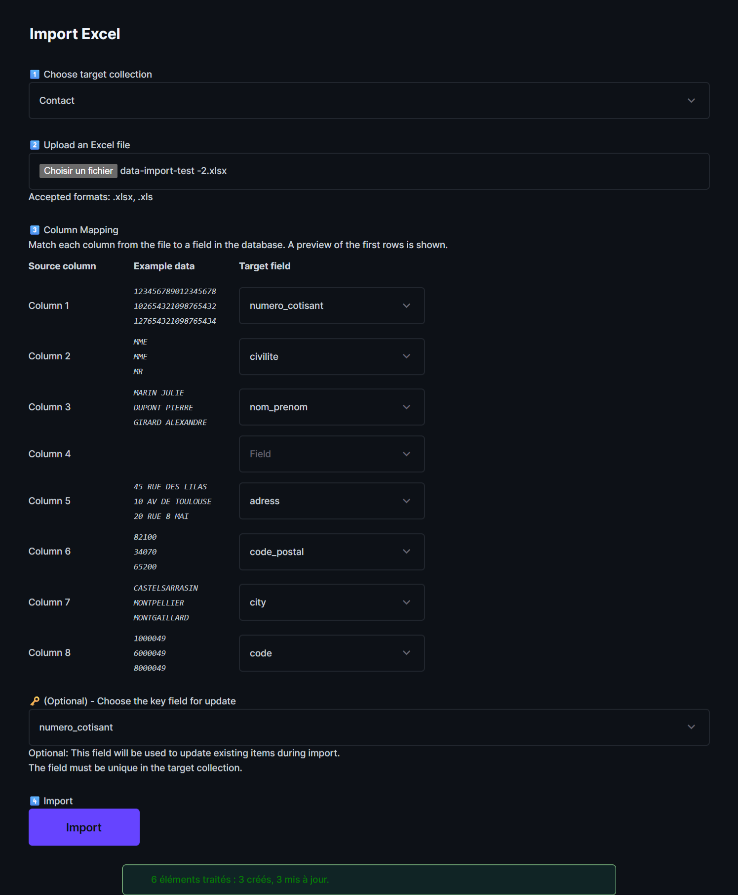

# Directus Extension: Import Excel

📥 A Directus custom **bundle** (module + endpoint) to import `.xlsx` Excel files **without headers** and manually map them to a collection's fields.

## 🚀 Features

- Upload `.xlsx` files via a custom UI
- Manual mapping of file columns to Directus collection fields
- Support for **multiple collections**
- **Optional upsert**: update items using a unique key (works only with fields marked as `unique` in Directus)
- **Field mapping redesigned**: vertical layout inspired by [NocoDB's import system](https://nocodb.com/docs/product-docs/tables/import-data-into-existing-table#field-mapping)
- **Clear and detailed feedback**:
- **Loading indicator** during import to show progress
- Interface and API fully **translated** (English, French & Turkish)
- Codebase fully rewritten in **English** for easier contributions

## 📸 Screenshots



## 📦 Installation

### ✅ Recommended (via Marketplace)

Install directly from the **Directus Marketplace**

[http://YourDirectusUrl:8055/admin/settings/marketplace/extension/678ba940-192e-4524-949f-8881ad1436bb](http://YourDirectusUrl:8055/admin/settings/marketplace/extension/678ba940-192e-4524-949f-8881ad1436bb)

Or search for `"fazcode"` or `"import excel"` (the name may evolve to reflect broader format support like JSON or CSV):  
[http://YourDirectusUrl:8055/admin/settings/marketplace?search=import+excel](http://YourDirectusUrl:8055/admin/settings/marketplace?search=import+excel)

### 🛠 Manual Installation

1. Clone the repository into your Directus `extensions` folder:

```bash
git clone https://github.com/FazCodeFR/directus-extension-import-excel.git ./extensions/televersement
```

2. Restart your Directus instance to load the new extension.
3. Navigate to the Directus admin panel and find the **"Téléversement"** module in the side menu.

## 🧪 Usage

1. Go to the **"Import Excel"** module in the Directus admin panel.
2. Upload your `.xlsx` file.
3. Map the columns from your Excel file to the fields in your Directus collection.
4. Optionally select a **unique field** to enable upsert (update if existing).
5. Click **"Import"** to start the process.
6. Get **detailed feedback** on the result of the import.

## 🤝 Contributing

Contributions are welcome!  
If you find a bug or have a feature request, please open an issue or submit a pull request on the GitHub repository.

## 🧾 License

This project is licensed under the MIT License.

## ✅ Compatibility

Tested with **Directus v11.8.0**

